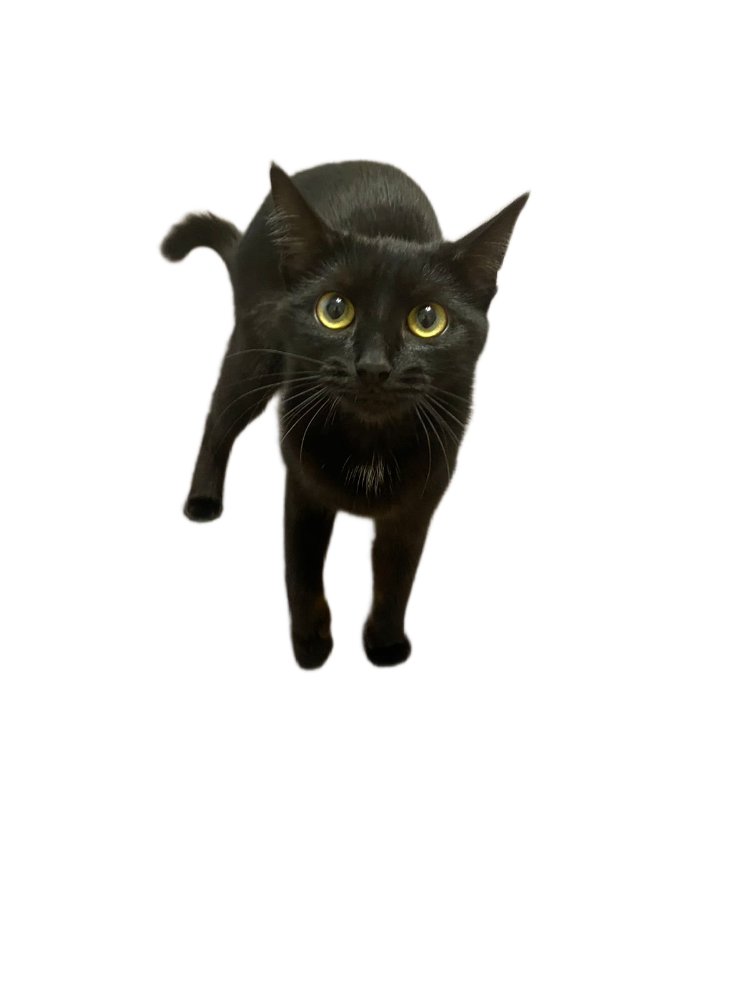

# 🔧 Исправление критических багов и обновления

## Проблема 1: Билеты не добавляются при высокой силе клика

### Причина:
EventCoins считались за один клик (`Math.floor(clicks / 10)`), что приводило к потере билетов при больших значениях clicks.

### Решение:
Считаем на основе общего прогресса батла:
```javascript
const newEventCoinsEarned = Math.floor(battle.scores[id] / 10);
const oldEventCoins = Math.floor(oldScore / 10);
const eventCoinsDiff = newEventCoinsEarned - oldEventCoins;
```

---

## Проблема 2: Бокс можно купить повторно после обновления

### Причина:
После покупки бокса данные не синхронизировались между `db.players` (БД) и `players` (память).

### Решение:
```javascript
// Синхронизация pendingBoxes в памяти
if (playerMem) {
  playerMem.pendingBoxes = playerDB.pendingBoxes;
}
```

---

## Проблема 3: Прогресс слетает при перезапуске сервера

### Причина:
`saveDB()` сохранял только `db.players` из файла, но не синхронизировал данные из `players` Map (активная память).

### Решение:
1. **Синхронизация перед сохранением:**
```javascript
function saveDB() {
  // Синхронизируем данные из players в db.players
  players.forEach((player, accountId) => {
    if (db.players[accountId]) {
      db.players[accountId].coins = player.coins;
      db.players[accountId].totalCoins = player.totalCoins;
      // ... все поля
    }
  });
  
  fs.writeFileSync(DB_PATH, JSON.stringify(db, null, 2), 'utf-8');
}
```

2. **Более частое автосохранение:** каждые 2 минуты
3. **Сохранение при SIGTERM (Render shutdown)**

---

## Проблема 4: Данные устаревают после 1 секунды

### Причина:
`handleUpdateScore` обновлял только `coins` в `db.players`, но не синхронизировал `perClick`, `perSecond` и другие поля.

### Решение:
```javascript
function handleUpdateScore(ws, coins, perClick, perSecond) {
  // Обновляем в памяти
  player.coins = coins;
  if (perClick) player.perClick = perClick;
  if (perSecond) player.perSecond = perSecond;
  
  // Обновляем ВСЕ поля в БД
  db.players[id].coins = coins;
  db.players[id].totalCoins = Math.max(db.players[id].totalCoins || 0, coins);
  if (perClick) db.players[id].perClick = perClick;
  if (perSecond) db.players[id].perSecond = perSecond;
  
  saveDB(); // Сохраняем сразу
}
```

---

## ✨ Новая функция: Скины в PvP батлах

### Что изменено:
- **Вместо кнопки "КЛИК!"** - теперь показаны скины игроков рядом
- **Визуальное сравнение** - игроки видят свои скины друг напротив друга
- **Анимация свечения** - скины пульсируют во время батла

### Структура HTML:
```html
<div class="battle-arena-display">
  <div class="battle-player-side">
    <div class="battle-player-skin">
      
    </div>
    <h3>Вы</h3>
    <div id="myBattleScore">0</div>
    <div id="myCPS">0 CPS</div>
  </div>
  <div class="vs">VS</div>
  <div class="battle-player-side">
    <div class="battle-player-skin">
      
    </div>
    <h3 id="opponentName">Соперник</h3>
    <div id="opponentScore">0</div>
    <div id="opponentCPS">0 CPS</div>
  </div>
</div>
```

### CSS стили:
- `.battle-arena-display` - flex-контейнер для арены
- `.battle-player-skin` - круглый фрейм для скина с анимацией свечения
- Анимация `battleSkinGlow` - пульсирующее свечение

### В client.js:
```javascript
function startBattleUI(data) {
  // Показываем мой скин
  const mySkin = skinsData.find(s => s.id === game.currentSkin);
  const mySkinImg = document.getElementById('myBattleSkin');
  if (mySkin && mySkinImg) {
    mySkinImg.src = mySkin.image;
  }
  
  // Показываем случайный скин соперника
  const randomSkin = opponentSkins[Math.floor(Math.random() * opponentSkins.length)];
  const opponentSkinData = skinsData.find(s => s.id === randomSkin);
  const opponentSkinImg = document.getElementById('opponentBattleSkin');
  if (opponentSkinData && opponentSkinImg) {
    opponentSkinImg.src = opponentSkinData.image;
  }
}
```

---

## ✅ Проверка навыков

Навыки работают корректно:
- **s1 - Двойной клик**: 2x за клик (1000 монет)
- **s2 - Критический удар**: 10% шанс 10x (5000 монет)
- **s3 - Авто-эффективность**: 2x за секунду (3000 монет)
- **s4 - Золотая лихорадка**: Бонусы дают 3x (2000 монет)
- **s5 - Мастер клика**: 5x за клик (10000 монет)
- **s6 - Бизнес-косатка**: 5x за секунду (15000 монет)

Все эффекты применяются при покупке через `skill.effect()`.

---

## Файлы изменены:

### Сервер:
- `websocket-server.js` 
  - `handleBattleClick` - билеты считаются на основе общего прогресса
  - `handleBuyBox` - полная синхронизация pendingBoxes
  - `handleUpdateScore` - полная синхронизация всех полей
  - `saveDB()` - синхронизация players → db.players перед сохранением
  - `SIGTERM` обработчик для Render shutdown
  - Автосохранение каждые 2 минуты

### Клиент:
- `client.js`
  - `startBattleUI` - отображение скинов игроков в батле
  - Настройки скинов для соперника (рандом)
  
- `index.html`
  - Новая структура `battle-arena-display` с скинами
  
- `style.css`
  - `.battle-arena-display` - стили арены
  - `.battle-player-skin` - круглый фрейм с анимацией
  - `.battle-player-side` - стили стороны игрока
  - Мобильная адаптация для новых элементов

---

## Тестирование:

### Билеты:
1. Начните батл с high CPS (>100)
2. Быстро кликайте
3. Проверьте что билеты начисляются корректно

### Бокс:
1. Купите бокс (1700 монет)
2. Обновите страницу
3. Проверьте что монеты уменьшились и бокс не доступен для повторной покупки

### Сохранение прогресса:
1. Наберите 1,000,000 монет
2. Перезапустите сервер
3. Проверьте что прогресс не слетел

### Навыки:
1. Купите навык в дереве
2. Проверьте что эффект применяется
3. Перезагрузите страницу - навык сохраняется

### PvP Батл:
1. Начните батл
2. Проверьте что ваши скины отображается слева
3. Проверьте что скин соперника отображается справа
4. Кликните - счётчики обновляются

---

**Готово! Все баги исправлены и добавлены новые фичи ✅**

**Что делать:**
1. Перезапустите сервер: `npm run dev`
2. Протестируйте батлы со скинами
3. Проверьте сохранение прогресса
